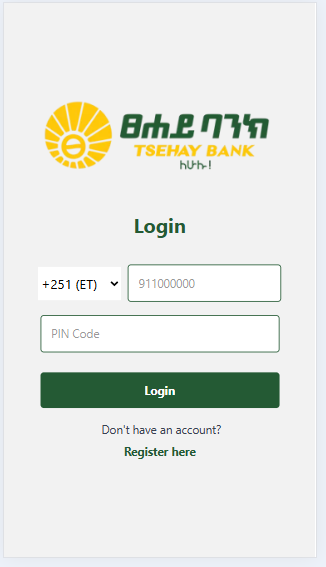
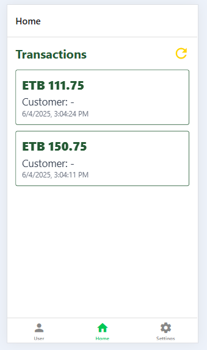
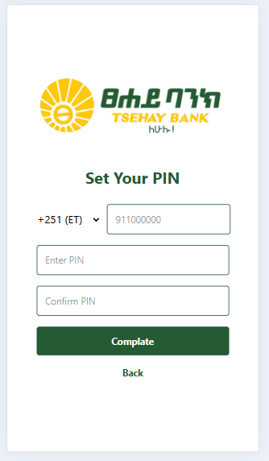
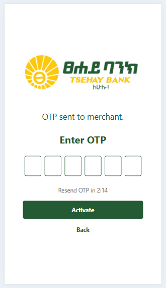

# Marchant

Marchant is a merchant management and transaction app built with React Native (frontend) and Node.js/Express (backend).  
It supports merchant login, OTP-based deactivation, PIN management, and transaction viewing.

## Features

- Merchant and employee login
- OTP-based employee deactivation
- PIN set/change for employees
- Transaction list with auto-refresh
- Secure authentication with JWT
- Feedback dialogs for all actions

## Screenshots


### Login Screen



### Home/Transactions



### Register



### OTP



## Getting Started

### Backend

1. Install dependencies:
   ```bash
   npm install
   ```
2. Configure your database in `backend/config/db.js`.
3. Start the backend server:
   ```bash
   node backend/server.js
   ```

### Frontend

1. Install dependencies:
   ```bash
   npm install
   ```
2. Start the app:
   ```bash
   npx expo start
   ```

## Folder Structure

```
backend/
  routes/
  config/
frontend/
  app/
  assets/
    images/
    screenshots/
```

## License

MIT
